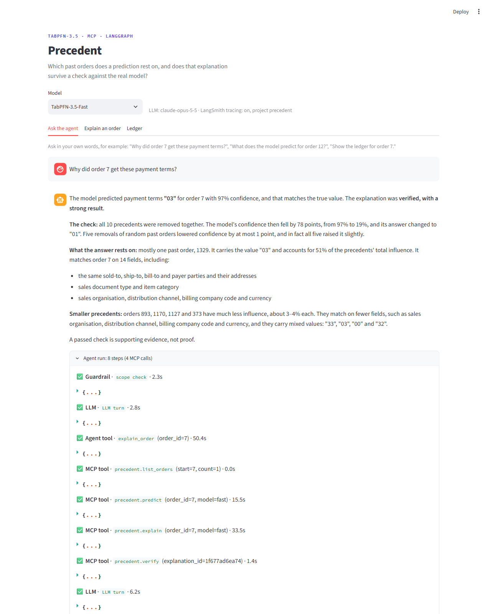
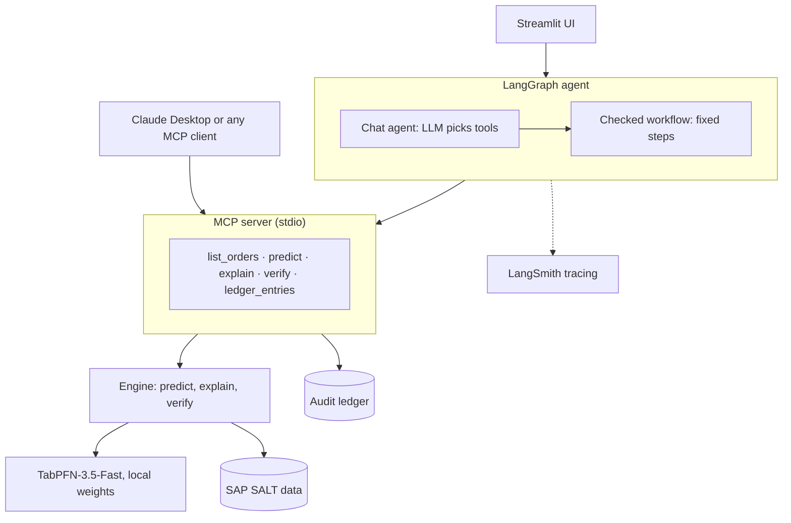
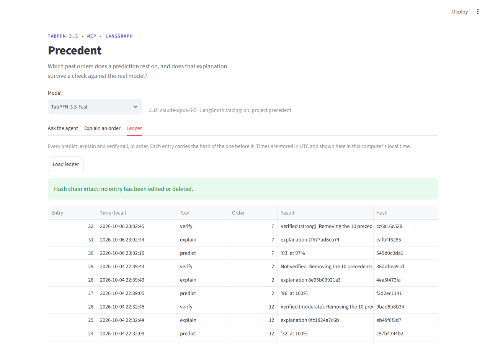

# Precedent

**Explanations you can check, for TabPFN-3.5 predictions.**

TabPFN predicts by reading past rows. Precedent names the past rows a prediction rests on (the *precedents*), then tests that claim by removing those rows from the model's context and asking again. Every call is written to a tamper-evident ledger.

Built for the Prior Labs TabPFN-3.5 Hackathon. It covers two of the suggested tracks: an **MCP server** with clear setup, and an **agent** that predicts, explains and acts on the result.



## Why

An enterprise can get an accurate prediction from a tabular foundation model. It is much harder to get a reason an auditor will accept.

- **No evidence a person can check.** Feature rankings on ERP data say "the customer number mattered", which explains nothing.
- **No test of the explanation.** Reasons are asserted, not verified.
- **No record.** Months later there is no trail of what was predicted, explained and checked.

Precedent answers in the form people already use at work: "we did this because of those earlier cases". Then it checks whether the answer really depends on those cases.

## How it works

TabPFN predicts from the rows it is shown, so rows can be removed and the question asked again with no retraining. A removal test costs one forward pass.

1. **Predict.** The full model reads 2,000 past orders and proposes a value for the new one.
2. **Explain.** Take the 60 past orders most similar to the new one. Hide a random half and ask the model how sure it is; repeat 180 times. A ridge regression of confidence on which orders were shown gives each order an *influence* score. The 10 highest are the precedents.
3. **Verify.** Remove those 10 from **all** past orders and ask the full model again. Do the same with 10 random non-precedent orders, five times. The explanation is **verified** only if the fall in confidence is at least 5 points and larger than every random fall.
4. **Record.** Append the call and its result to a ledger in which each entry carries the hash of the one before.

The answer being explained is always the full model's answer. The small 60-order context is used only to search for precedents.

## Results

### The experiment: 100 sales orders

Task: predict `CUSTOMERPAYMENTTERMS` (10 classes) on SAP's SALT dataset, with TabPFN-3.5-Fast and 2,000 past orders in context. The model was right on 64.6% of 1,000 held-out orders; always guessing the most common class scores 31.3%.

For 100 held-out orders, the precedents were found and then removed from the full model's context:

| Removed from the full model | Average fall in confidence | Answer changed |
| --- | --- | --- |
| Top-10 precedents | 15.5 points | 33% of orders |
| 10 most similar orders | 3.8 points | 12% |
| 10 random candidates | 0.2 points | 5% |

- **44% of explanations were verified** against the full model. The tool flagged the other 56%.
- Precedents beat the most similar orders in 78 of 100 cases.
- The typical effect is small: the median fall was 4.5 points. The orders split into 15 where confidence fell by more than 40 points, 32 where it fell by 5 to 18, and 53 where almost nothing moved. For most predictions, ten past orders are not the whole reason.
- All 15 strong cases had at least one precedent from the same customer as the new order. This is a pattern, not a tested cause.

**Local tests overstate faithfulness.** An earlier run tested precedents against a small local model (the 60 nearest orders) instead of the full one. On the same 100 orders it verified 88%. Against the full model, 44% held. An explanation can pass a shortcut test and fail on the model people would use.

### Four orders from the working demo

| Order | Model's answer | Confidence | After removing precedents | Verdict |
| --- | --- | --- | --- | --- |
| 7 | 03 | 97% | 19%, answer becomes 01 | Verified, strong |
| 12 | 32 | 100% | 80%, answer unchanged | Verified, moderate |
| 5 | 33 | 24% | 17%, answer becomes 32 | Verified, weak |
| 2 | 96 | 100% | 100%, no change | Not verified |

For order 7, one precedent (past order 1329) carries about half of the influence. It has the same customer, payer and ship-to address as the new order and was on terms 03. For order 2, the agent replies that it could not confirm the explanation and names no past orders.

### What these results do and do not show

- They cover one task on one dataset, with TabPFN-3.5-Fast and a single ensemble member.
- The 100-order experiment drew its random comparison from all candidates, which can include a precedent by chance. The tool now draws from non-precedents only. Correcting the experiment could raise 44% to 47% at most; it has not been rerun.
- A verified result is supporting evidence, not proof. It compares against five random removals.
- No comparison with SHAP has been run. Precedent answers a different question (which rows, not which fields) and is meant to complement it.

## Architecture



| Part | File | What it does |
| --- | --- | --- |
| Engine | `src/precedent/engine.py` | `predict`, `explain`, `verify` |
| Data | `src/precedent/data.py` | Prepares SAP SALT or any CSV as a prediction task |
| Ledger | `src/precedent/ledger.py` | Append-only JSONL log with a hash chain |
| MCP server | `src/precedent/server.py` | Exposes the engine as five tools over stdio |
| Agent | `src/precedent/agent.py` | LangGraph chat agent on top of a fixed, checked workflow |
| UI | `src/precedent/app.py` | Streamlit app: ask the agent, explain an order, read the ledger |
| Guardrails | `src/precedent/guardrails.py`, `src/precedent/guardrails.toml` | Keeps the chat on topic; the rules are in the TOML file and can be edited |
| Env loader | `src/precedent/env.py` | Reads tokens from a `.env` file |
| Tests | `tests/` | Run with a stand-in model; no weights, data or keys needed |
| Notebooks | `notebooks/` | The Kaggle experiments behind the results above |

## Setup

Requirements: Python 3.10 or newer. It runs on CPU; a GPU makes the full-model calls faster.

```bash
python -m venv .venv
source .venv/bin/activate          # Windows: .venv\Scripts\activate
pip install -e ".[dev,agent]"
pytest -q                          # uses a stand-in model; no downloads
```

On Windows, `pip` installs a CPU-only PyTorch by default. For an NVIDIA GPU, install the CUDA build from the selector at https://pytorch.org/get-started/locally/ and confirm with `python -c "import torch; print(torch.cuda.is_available())"`.

### Tokens

Copy `.env.example` to `.env` and fill it in. The file is git-ignored.

| Variable | Needed for | Notes |
| --- | --- | --- |
| `TABPFN_TOKEN` | The model | A Prior Labs API key, with the TabPFN-3.5 licence accepted in your account. Used only to download the weights; the model runs locally. |
| `HF_TOKEN` | The default dataset | A Hugging Face read token, with access granted to the gated dataset `SAP/SALT`. |
| `ANTHROPIC_API_KEY` | The chat agent | Optional. Without an LLM the "Explain an order" tab still works, with template wording. |
| `PRECEDENT_LLM` | Choosing the LLM | Optional. A LangChain model string, for example `anthropic:claude-opus-5-5`. |
| `LANGSMITH_TRACING`, `LANGSMITH_API_KEY`, `LANGSMITH_PROJECT` | Tracing | Optional. |

No SALT access? Any CSV with a categorical column to predict works: add `--dataset csv --csv orders.csv --target YOUR_COLUMN`.

## Run it

**1. Check the engine** (no MCP involved):

```bash
python examples/try_engine.py --order 7
```

The first run downloads SALT and the model weights and caches the prepared task under `~/.cache/precedent`.

**2. The web UI:**

```bash
streamlit run src/precedent/app.py
```

- **Ask the agent:** free-form questions, such as "Why did order 7 get these payment terms?" Each reply has an "Agent run" panel listing the LLM turns and MCP calls with timings, and a details panel with the removal bars and the precedent table.
- **Explain an order:** a form that runs the checked workflow for one order.
- **Ledger:** every `predict`, `explain` and `verify` call, with the hash-chain status.



**3. The agent from the terminal:**

```bash
precedent-agent --order 7
```

**4. Claude Desktop, or any MCP client.** Add the server to the client's MCP configuration. Templates are in `examples/mcp_config.json` and `examples/mcp_config_windows.json`; fix the paths. The server reads tokens from the `.env` file named there, so no secrets go into the client's settings. For Claude Code, run `bash examples/claude_code_add.sh` from the repo folder.

Typical timings on a consumer NVIDIA GPU: `predict` under a second, `explain` 30 to 40 seconds, `verify` 2 to 8 seconds. The data and model load on the first tool call.

## MCP tools

| Tool | Purpose |
| --- | --- |
| `list_orders` | Show held-out orders and their fields |
| `predict` | The full model's answer and confidence for one order |
| `explain` | Find the precedents for that answer (unverified until checked) |
| `verify` | Remove the precedents, re-ask, compare with random removals; returns the verdict, the size of the fall and a plain-language summary |
| `ledger_entries` | Read the audit log and check its hash chain |

`predict` and `explain` accept either `order_id` (a held-out order) or `fields` (values for a new order). The engine tools take `model`: `"fast"` (TabPFN-3.5-Fast) or `"base"` (TabPFN-3.5). Both run on local weights.

The verdict comes with a strength label: strong (a fall of 40 points or more), moderate (15 to 40) or weak (5 to 15). These bands are reporting conventions, not validated thresholds.

## The agent

The agent has two layers.

- **A chat agent** chooses among four tools: `list_orders`, `predict_order`, `explain_order` and `read_ledger`.
- **A fixed workflow** sits behind `explain_order`: resolve the order, predict, explain, verify, report. The chat agent cannot reach `explain` or `verify` any other way.

Two guardrails follow from that design:

- **The check cannot be skipped.** Every explanation is verified before it is worded.
- **Unverified precedents are withheld.** If the check fails, the precedent rows are not passed to the language model, so it cannot present them as the reason.

The chat also stays on topic. Before the agent sees a message, it is checked against `src/precedent/guardrails.toml`: instant pattern checks (for example "ignore previous instructions"), then a short scope check by the language model. Anything outside the Precedent tool gets a fixed refusal. Edit the file to change the topic, the allowed and blocked lists, or the refusal text; it is re-read on every message, so no restart is needed. Set `PRECEDENT_GUARDRAILS` to use a different file. The scope check is a safeguard, not a security boundary: if the check call itself fails, the message is let through and the agent's own instructions still apply.

The language model only words the answer, from the tool results. With LangSmith enabled, each run is traced with one span per step and per MCP tool call.

## Data and privacy

- The model runs on local weights, so order data stays on your machine.
- Two optional features send data out: the LLM that words answers, and LangSmith tracing. Both receive order fields and, for verified explanations, precedent details.
- SALT is licensed CC-BY-NC-SA 4.0 (non-commercial). It is downloaded at run time and is not part of this repository.
- The TabPFN-3.5 weights are released under Prior Labs' own licence, which you accept in your Prior Labs account. Check its terms for your use.
- The ledger stores times in UTC. The UI shows them in local time.

## Limits

- One task, one dataset, one model variant. See "What these results do and do not show".
- Fewer than half of explanations were verified. For the rest, the tool can say only that ten past orders are not the reason.
- Precedents are searched among the 60 most similar past orders. An influential order outside that pool is missed.
- Similarity uses a simple encoded distance, which is crude for ID-like fields.
- The `CREATIONTIME` field is passed to the model as text, which TabPFN warns adds noise. It is left unchanged to match the experiments.
- TabPFN-3.5-Plus and Thinking run on the hosted API and are not supported yet.
- Explanations are held in memory. After a restart, call `explain` again before `verify`.

## What comes next

- Rerun the 100-order experiment with the corrected check, on more targets and datasets.
- Explain predictions that rest on many orders, by removing larger groups, so that "not verified" becomes "rests on about this many".
- Support the hosted models: search with the local model, verify on the hosted one.
- Trial the verdict as a triage rule with real users.

## Prior work

The influence estimator is not new. It follows datamodels (Ilyas et al., 2022, arXiv:2202.00622) and ContextCite (Cohen-Wang et al., 2024, arXiv:2409.00729), which fit a linear surrogate to random ablations of training data or context. Rundel et al. (2024, arXiv:2403.10923) used in-context "retraining" for Data Shapley on TabPFN, valuing rows by overall validation risk. KernelICL (Miftachov et al., 2026, arXiv:2602.02162) gives per-prediction sample weights by changing the model's prediction head.

Precedent applies the estimator to single predictions of an unmodified TabPFN-3.5, checks each explanation by removal against the full model, and logs the outcome. To our knowledge, based on a literature and repository search on 2 October 2026, per-prediction, removal-verified row explanations with an audit trail had not been published for a tabular foundation model.

Dataset: SALT (Klein et al., 2024, arXiv:2501.03413). Model: TabPFN-3.5 (Prior Labs, 2026, arXiv:2609.17895).
